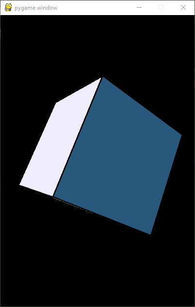

# 3D Cube
- Uses python and pygame library
- Original inspiration come from [stack overflow](https://stackoverflow.com/questions/20477549/python-3d-cube-with-4-perspectives)
- simplified the code base
- added colors
- added mouse rotation
- Added colors from [coolors.co](https://coolors.co/eeeeff-7f7caf-9fb4c7-28587b-9fb798-db2955)

